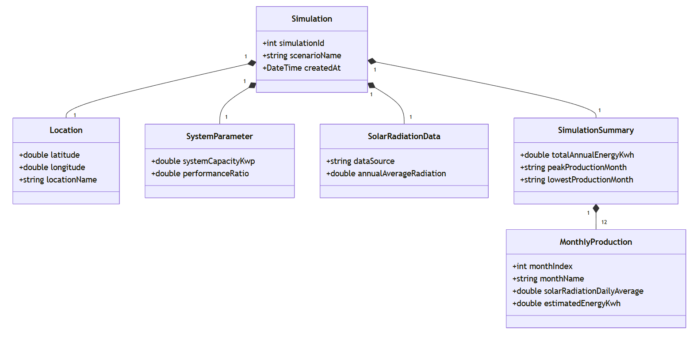
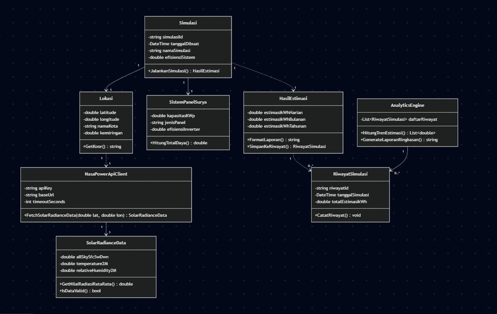

# Class Diagram SolarScope

Status: draft perancangan Minggu 2, menunggu penyelarasan tim.

## Versi sederhana

Sumber: `class-simple.png` dari anggota tim. Menampilkan `Simulation`, `Location`, `SystemParameter`, `SolarRadiationData`, `SimulationSummary`, dan `MonthlyProduction`.

## Versi dengan method

Sumber: `class.jpeg` dari anggota tim. Menampilkan class beserta method, termasuk `Simulasi`, `Lokasi`, `SistemPanelSurya`, `HasilEstimasi`, `NasaPowerApiClient`, `SolarRadianceData`, `AnalyticsEngine`, dan `RiwayatSimulasi`.

## Catatan penyelarasan

Kedua gambar dipertahankan tanpa perubahan isi. Versi dengan method bukan sekadar versi sederhana yang ditambahkan method: nama class, tipe ID simulasi (`int` dan `string`), serta struktur parameter dan hasil berbeda. Tim perlu menetapkan pemetaan atau model yang disepakati sebelum implementasi.

Penyebutan NASA POWER pada gambar merupakan rancangan kandidat integrasi, bukan penetapan API final. Dokumen ini juga tidak menetapkan pilihan database atau formula final.

Berkas sumber yang dapat diedit belum tersedia dalam unggahan ini. Tambahkan sumber asli saat tersedia; jangan menganggap gambar sebagai sumber yang dapat diedit.
