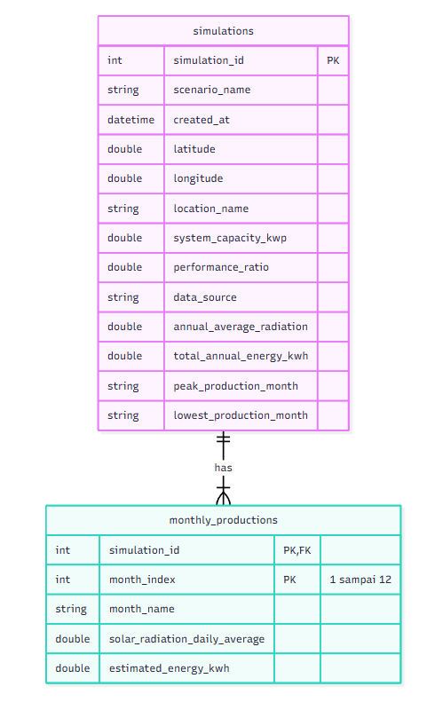

# Entity Relationship Diagram (ERD) — SolarScope

Dokumen ini mendeskripsikan model data relasional (ERD) untuk aplikasi SolarScope yang diimplementasikan pada database lokal (SQLite).

---

## Pratinjau ERD

---

## 1. Penjelasan Relasi Antar Entitas

Pada skema basis data SolarScope, terdapat 2 entitas utama dengan relasi **One-to-Many (1 : N)**:

### A. Kardinalitas dan Modalitas
* **Relasi:** `simulations` **HAS** `monthly_productions`
* **Kardinalitas:** 
  * **Satu ke Banyak (1 : N):** Satu data simulasi (`simulations`) memiliki tepat 12 baris data produksi bulanan (`monthly_productions`), merepresentasikan bulan Januari hingga Desember.
  * Setiap satu baris data produksi bulanan hanya boleh terikat pada **satu** data simulasi induk.
* **Modalitas / Partisipasi:**
  * Sisi `simulations` bersifat entitas mandiri (induk).
  * Sisi `monthly_productions` bersifat *mandatory* (total participation), artinya data produksi bulanan tidak dapat berdiri sendiri tanpa adanya entitas induk `simulations`.

### B. Jenis Relasi (Identifying Relationship)
* Relasi ini merupakan **Identifying Relationship** (relasi kuat/identifikasi).
* Kunci utama entitas induk (`simulation_id`) diturunkan menjadi bagian dari **Composite Primary Key** pada entitas anak (`monthly_productions`), yaitu kombinasi `(simulation_id, month_index)`.
* Hal ini menjamin integritas data pada tingkat database bahwa tidak akan pernah ada data ganda untuk bulan yang sama pada satu simulasi yang sama.

### C. Integritas Referensial (Referential Integrity)
* **Foreign Key:** Kolom `simulation_id` pada `monthly_productions` merujuk ke `simulation_id` pada `simulations`.
* **Aksi Referensial (`ON DELETE CASCADE`):** Jika sebuah data riwayat simulasi pada tabel `simulations` dihapus oleh pengguna, maka seluruh 12 baris data produksi bulanan terkait pada tabel `monthly_productions` akan otomatis ikut terhapus dari basis data untuk mencegah data yatim (*orphan records*).

---

## 2. Penjelasan Tipe Data, Constraint, dan Besaran Atribut

Berikut adalah rincian kamus data (*data dictionary*) untuk masing-masing entitas beserta satuan/besaran teknis yang digunakan:

### A. Entitas `simulations` (Tabel Induk Riwayat Simulasi)
Tabel ini menyimpan metadata simulasi, parameter input pengguna, titik lokasi geografis, serta ringkasan akumulasi hasil estimasi tahunan.

| Nama Atribut | Tipe Data (Model / SQLite) | Constraint | Besaran / Satuan | Keterangan & Batasan |
| :--- | :--- | :--- | :--- | :--- |
| `simulation_id` | `int` / `INTEGER` | **PK**, Auto Increment | Dimensi nominal (ID) | Pengenal unik untuk setiap transaksi simulasi. |
| `scenario_name` | `string` / `TEXT` | NOT NULL | Teks deskriptif | Label atau nama skenario simulasi yang diinput pengguna (misal: "Atap Rumah"). |
| `created_at` | `datetime` / `TEXT` | NOT NULL | Format Waktu (ISO 8601 UTC) | Waktu saat simulasi dihitung dan disimpan (`YYYY-MM-DD HH:MM:SS`). |
| `latitude` | `double` / `REAL` | NOT NULL | Derajat Desimal (° / Deg) | Titik lintang geografis lokasi panel surya (Rentang valid: -90.0 s/d 90.0). |
| `longitude` | `double` / `REAL` | NOT NULL | Derajat Desimal (° / Deg) | Titik bujur geografis lokasi panel surya (Rentang valid: -180.0 s/d 180.0). |
| `location_name` | `string` / `TEXT` | Nullable | Teks | Nama tempat, kota, atau label acuan yang dimasukkan pengguna. |
| `system_capacity_kwp` | `double` / `REAL` | NOT NULL | **Kilowatt-peak (kWp)** | Kapasitas daya puncak sistem panel surya pada kondisi standar (*STC*). Nilai > 0. |
| `performance_ratio` | `double` / `REAL` | NOT NULL, Default `0.75` | Rasio tanpa satuan (0.01 - 1.00) | Faktor efisiensi sistem yang memperhitungkan rugi-rugi (*losses* kabel, suhu, inverter). |
| `data_source` | `string` / `TEXT` | NOT NULL | Teks | Identitas penyedia data radiasi (default: `"NASA POWER Climatology"`). |
| `annual_average_radiation` | `double` / `REAL` | NOT NULL | **$\text{kWh/m}^2\text{/hari}$** | Rata-rata radiasi penyinaran matahari harian sepanjang satu tahun. |
| `total_annual_energy_kwh` | `double` / `REAL` | NOT NULL | **Kilowatt-hour (kWh)** | Total akumulasi estimasi produksi energi listrik selama 1 tahun penuh (12 bulan). |
| `peak_production_month` | `string` / `TEXT` | NOT NULL | Nama bulan | Bulan dengan estimasi produksi energi tertinggi dalam setahun (misal: "August"). |
| `lowest_production_month`| `string` / `TEXT` | NOT NULL | Nama bulan | Bulan dengan estimasi produksi energi terendah dalam setahun (misal: "December"). |

---

### B. Entitas `monthly_productions` (Tabel Rincian Produksi Bulanan)
Tabel ini menyimpan hasil rincian produksi energi untuk setiap bulan (12 baris data per satu simulasi).

| Nama Atribut | Tipe Data (Model / SQLite) | Constraint | Besaran / Satuan | Keterangan & Batasan |
| :--- | :--- | :--- | :--- | :--- |
| `simulation_id` | `int` / `INTEGER` | **PK**, **FK** | Dimensi nominal (ID) | Mengacu ke `simulations.simulation_id` (`ON DELETE CASCADE`). |
| `month_index` | `int` / `INTEGER` | **PK** | Indeks numerik (1 s/d 12) | Urutan bulan kalender (1 = Januari, 2 = Februari, ..., 12 = Desember). |
| `month_name` | `string` / `TEXT` | NOT NULL | Teks singkatan / label | Label bulan (Jan, Feb, Mar, Apr, Mei, Jun, Jul, Agu, Sep, Okt, Nov, Des). |
| `solar_radiation_daily_average` | `double` / `REAL` | NOT NULL | **$\text{kWh/m}^2\text{/hari}$** | Rata-rata radiasi harian pada bulan berjalan dari NASA POWER (`ALLSKY_SFC_SW_DWN`). |
| `estimated_energy_kwh` | `double` / `REAL` | NOT NULL | **Kilowatt-hour (kWh)** | Estimasi produksi energi bulanan ($P_{\text{peak}} \times G_{\text{harian}} \times \text{hari} \times \text{PR}$). |

---